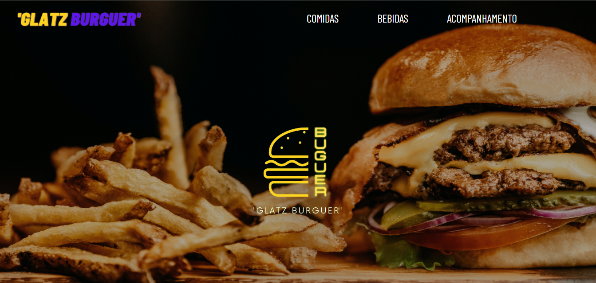

# GlatzBurguer

<!---Esses são exemplos. Veja https://shields.io para outras pessoas ou para personalizar este conjunto de escudos. Você pode querer incluir dependências, status do projeto e informações de licença aqui--->

>O projeto foi a partir de um trabalho de artes no meu colegio. 
O desafio era fazer um site de Fast-Food apresentavel e "funcional".

### Ajustes e melhorias

O projeto ainda está em desenvolvimento e as próximas atualizações serão voltadas nas seguintes tarefas:

- [x] Wireframe
- [x] Navbar
- [x] Body
- [x] Formatação do site
- [ ] Responsividade

## 🤝 Responsáveis

Às seguintes pessoas que contribuíram para este projeto:

<table>
  <tr>
    <td align="center">
      <a href="#">
         
        
          <b>Gabriel Glatz</b>
        
      </a>
    </td>
  </tr>
</table>

[⬆ Voltar ao topo](#GlatzBurguer) 
